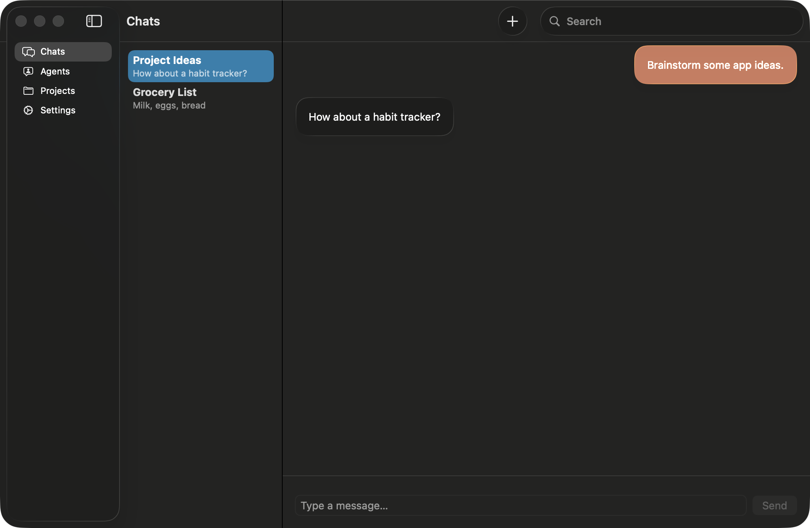
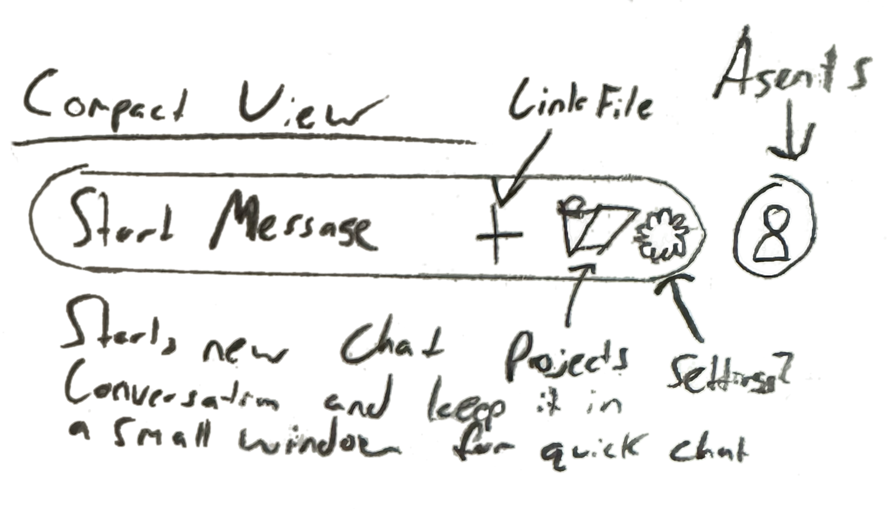

# MacOS Feature Rich AI Chat App

## Motivation
AI is making it hard for Junior Devs to get started so I want to understand it better and build something. From this app I want to make a polished app to release and learn how to make LLMs work better with projects. 

I want to create something that is customizable, usable, fast and attractive. I’ve used typing mind but that slows down way too much after being used for lots of chats.

## Technologies
- SwiftUI
- AI API interfacing

## Design Ideas
* Liquid Glass
* Normal Chat Interface
* [Compact View](./docs/CompactView.md): Similar look to spotlight/ ChatGPT app
* Index codebases for better responses
* Integrate with terminals (iTerm, Ghostty) as well as NeoVim
* Customizable Agents
## Data
Conversation
- id: UUID
- title: String
- createdAt: Date
- messages: [Message]

Message
- id: UUID
- role: String   // "user", "assistant"
- content: String
- createdAt: Date
- conversation: Conversation (relationship)

Project
- id: UUID
- name: String
- location: String
- createdAt: Date
- conversation: Conversation (relationship)

Agent
- id: UUID
- name: String
- prompt: String
- desc: String
- createdAt: Date
- updatedAt: Date
- conversation: Conversation (relationship)

## Views
For the main view I am using the SwiftUI NavigationSplitView with 3 layers of content:
1. **Sidebar View**
    - Chats
	- Agents
	- Projects
	- Settings
2. **Content Column View**
	- List of chosen Sidebar items
3. **Detail View**
    - Detailed view of selected item from Chats/Agents/Projects

For the compact view I haven’t created anything but I want it to look something like this:

## TODO
1. Hook up OpenAI API
2. Save API keys
3. Setup Agent view and logic
4. Setup Project view
5. Scan Project files and create directory layout
6. Create separate Compact View
7. iCloud syncing
